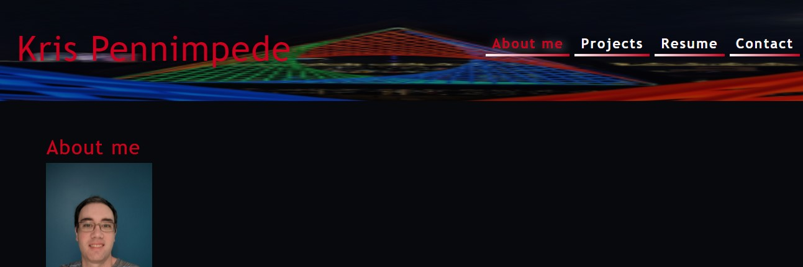
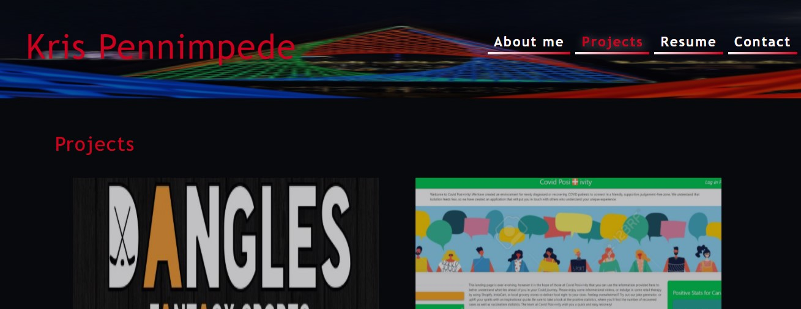
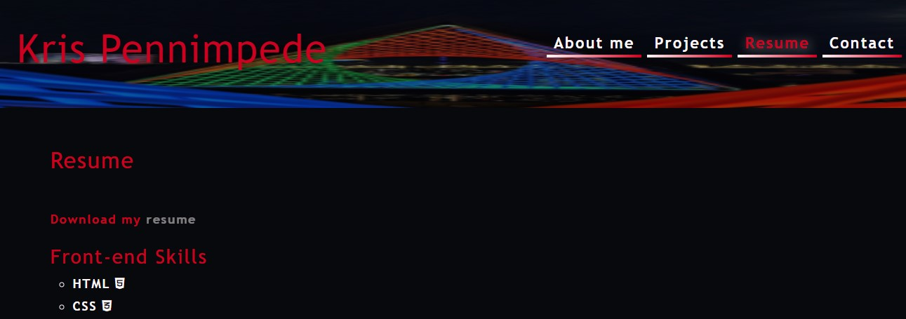
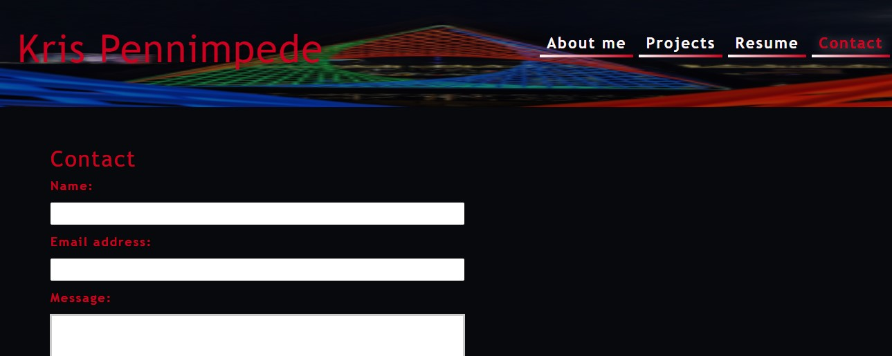

# React Portfolio

An updated version of my portfolio website built using React
This project was bootstrapped with [Create React App](https://github.com/facebook/create-react-app).

## Description

This a redesign of my portfolio website at https://krispywing.github.io/ only this time it is built using React. 

When first visting the site you will be presented with an About me page, clicking on any of the other items in the navbar will dynamically replace the current content with the new content with out reloading the page. 

There are 4 "pages"
* About Me 
* Projects 
* Resume 
* Contact

For the sake of time this mostly followed the design of the mock-up provided in class. In the future when I am  more comfortable with react I would like to update the design to something with a little more flair.

## Table of Contents
* [Installation](#Installation)
* [Usage](#Usage)
* [Technologies](#Technologies)
* [Preview](#Preview)

## Installation
No Installation is necessary as the website is deployed on github pages.

## Usage
Page can be viewed at https://krispywing.github.io/react-portfolio

## Technologies
This application was made using

 

## Preview

### Screenshots
#### About Me

#### Projects

#### Resume

#### Contact

